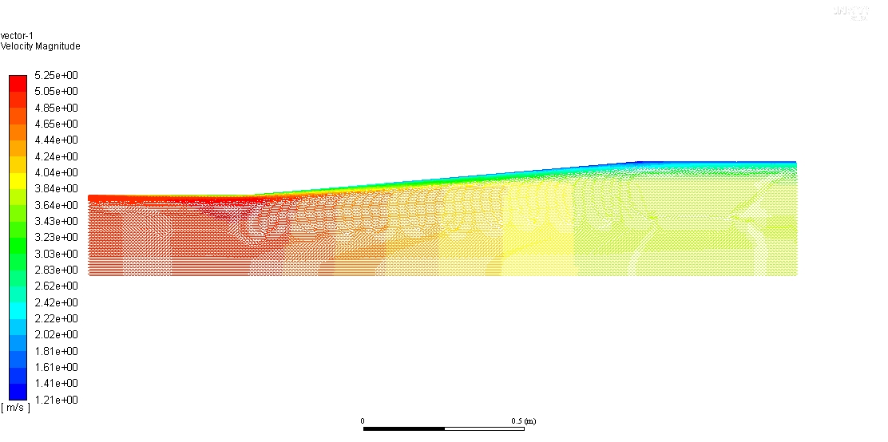
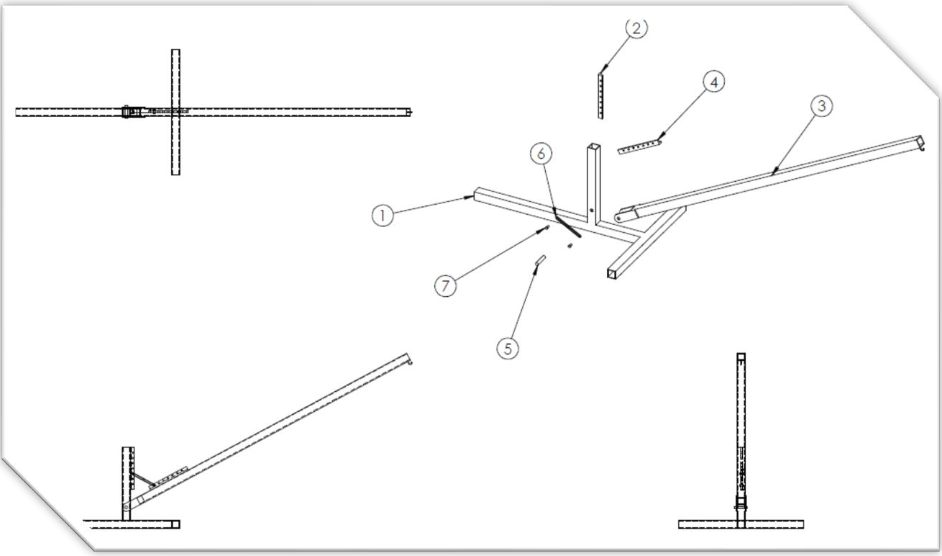
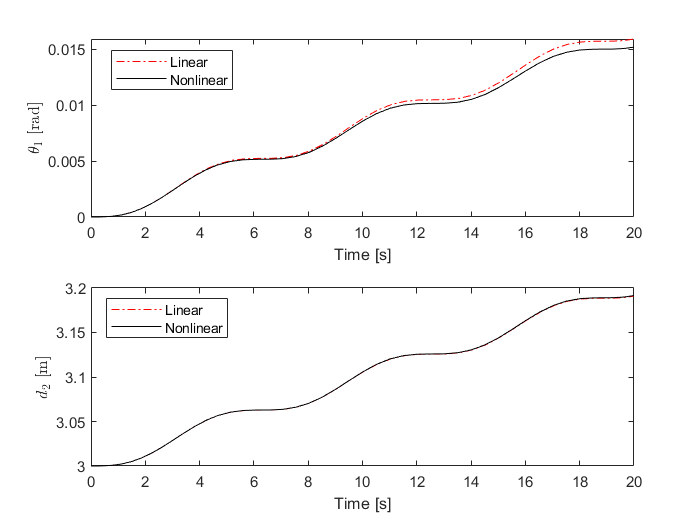
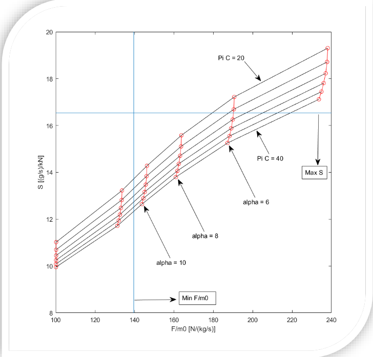

# Numerical methods
Repo for class projects and homework in numerical methods.

## Includes
- **CFD** - scripts for solving Navier-Stokes in Matlab
- **CraneOpt** - scripts for optimizing a crane linkage component
- **NumSolver** - implementations of generic numerical solver methods (Runge Kutta, Newton-Raphson, etc.)
- **Turbofan** - analysis scripts of turbofan engine performance

**Fig 1.** Velocity field in a diffuser using the k-epsilon turbulence model in ANSYS Fluent.

**Fig 2.** Solidworks drawing of the optimized crane linkage system.

**Fig 3.** Runge Kutta solutions to linear and nonlinear systems of ODEs.

**Fig 4.** Carpet plot showing a turbofan engine thrust-specific fuel consumption (S) versus its specific thrust (F/m).
